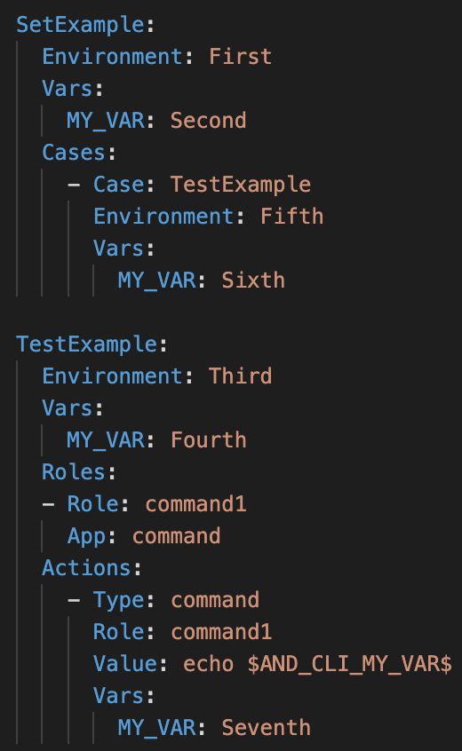

# About
TestRay is a Ruby gem used to run YAML-based automation tests, using Selenium and Appium. While originally compatible only with Android, in its current iteration it can also automate iOS, web, Windows and Mac applications - and with multi-platform support!

## Index
1. [Installation](#installation)
2. [TestRay Examples](#examples)
3. [Configuration and Steps](#conf_steps)
4. [Usage](#usage)
5. [Writing Steps](#writing_steps)
6. [Creating Config File for Apps and Devices](#conf_file_app_dev)
7. [Create Test Case](#test_case)
8. [Vars](#vars)
9. [Roles](#roles)
10. [Page Object Model](#pageobjectmodel)
11. [Action Types](#actions)

## Installation
TestRay has been tested to work on both Mac (Intel/M1) and Windows.

One way to install the framework is by creating a Gemfile with the following content and then running `bundle install`:

<pre>
gem "testray", :git => "https://github.com/testdevlab/TestRay.git"
</pre>

then you can use `bundle install --binstubs` to generate a bin folder with the testray exec and execute it like:

<pre>
./bin/testray -h
</pre>

Another way to install master is to download this project and use `rake install`

[See here for full installation instructions.](./SETUP.md)

If you do not need the full YAML test suite alongside TestRay, and have set up the prerequisites, you can install TestRay on its own like so:
<pre>rake install</pre>

## TestRay Examples

There is a folder `examples` that contains different use cases for TestRay. The basic one, with most of the possible roles and cases is under `examples/tests` folder. In order to execute this tests you can either download this folder into your project as a template, or directly clone TestRay Project and navigate to the folder:

<pre>
cd examples/tests
testray execute TestAssertsGreaterError
</pre>

In this previous example we are executing `TestAssertsGreaterError` case which is under `examples/tests/cases/case_asserts.yaml`. More about the folder extructure, configuration and steps in the next section.

## Configuration and Steps

For most actions, TestRay will require a config file. This should exist as `cases/config.yaml`, relative to your current working directory.

Executing tests further requires test files, which should also be placed in the aforementioned `cases` folder.

It is **not** advised to use the `cases` folder of TestRay itself, since that folder is meant for tests to validate TestRay functionality.

## Usage

Run `testray help` to see available commands. Help can also be called for each command to see available options.

Specifically for execution: To execute a test case called `MyTestCase`, run `testray execute MyTestCase`.

<!-- [See here for a full list of available commands.]() -->

## Writing Steps

Template for step file:

    <App>:
        Actions:
        - Type: <type>          
          Role: <role>
          Strategy: <locator_strategy>
          Id: <element_id>
          FailCase:
            - Value: <case>
            - ContinueOnFail: <boolean>
        - Type: <type>
          ...

**app** is app which has it's app package and activity in config \
**type** can be click|press|get_attribute|set_attribute|remove_attribute|wait_for|swipe_up|swipe_coord|send_keys|swipe|clear_field (and many more)\
**role** which role executes given step (roles are defined for each device in config) \
**strategy** is appium locator strategy like accessibility_id|id|xpath ... \
**id** is locator for the given strategy

**FailCase** can be specified for a step. This will be executed if *RuntimeError* was encountered while executing step \
*case* is the name of test case that will be executed \
*boolean* value can be true|false which will determine if test execution will continue after failcase execution

One step file includes all needed apps.

## Creating Config File for Apps and Devices

Adding Apps configuration:
<pre>
Apps:
  SomeApp:
    Package: com.some.App
    Activity: com.some.App.auth.StartScreenActivity
    Download: https://apkpure.com/someApp-SomeApp/com.some.App
    iOSBundle: com.some.SomeApp
    WinPath: C:\Users\user\AppData\Local\Programs\SomeApp\SomeApp.exe
    UWPAppName: SOMEAPP.1234567890ABC_defghijklmnop!App
    MacAppName: com.someapp
</pre>

This will add all the necessary capabilities to run on iOS, MacOS, Windows and Android

Adding Test Device Configuration:

Selenium Browser (Two roles defined with the same capabilities - desktop1 and desktop2)
<pre>
Devices:
  - role: desktop1,desktop2
    seleniumUrl: http://192.168.1.1:4444/wd/hub/
    capabilities:
      prefs:
          profile.default_content_setting_values.notifications: 2
      chromeOptions:
        args:
          - use-fake-ui-for-media-stream
          - use-fake-device-for-media-stream
          - no-sandbox
          - use-file-for-fake-audio-capture=/home/testdevlab/silence.wav
          - use-file-for-fake-video-capture=/home/testdevlab/video_720.y4m
          - --headless
    browser: chrome
</pre>

Android Browser
<pre>
Devices:
  - role: localMobileBrowser
    platform: Android
    capabilities:
      chromeOptions:
        args:
          - use-fake-ui-for-media-stream
          - use-fake-device-for-media-stream
          - use-file-for-fake-audio-capture=/home/testdevlab/silence.wav
          - no-sandbox
</pre>

Android App
<pre>
Devices:
  - role: androidTest
    platform: Android
</pre>

iOS App/Browser
<pre>
Devices:
  - role: mobileiOS
    platform: iOS
</pre>

MacOS/Windows
<pre>
Devices:
  - role: macLocal
    platform: Mac
  - role: localWindows
    platform: Windows
</pre>

## Create Test Case

All the test cases need to be in YAML files called `case_*.yaml` (case_example.yaml), and placed in the `cases` folder in your working directory.

<pre>
MyTestDesktopAndroidApp:
  ParallelRoles: true
  Vars:
    SOME_VAR: value
  Roles:
  - Role: androidTest
    App: SomeApp
  - Role: desktop1
    Capabilities:
      chromeOptions:
        args:
          - use-file-for-fake-audio-capture=/home/testdevlab/audio.wav
          - use-file-for-fake-video-capture=/home/testdevlab/video.y4m
    App: desktop
  - Role: command1
    App: command
  Actions:
    - Type: case
      Value: MyTestDesktopChromeStart
    - Type: sync
    - Type: case
      Value: MyTestJoinAndroidAppDeepLink

MyTestDesktopChromeStart:
  ParallelRoles: true
  Roles:
    - Role: desktop1
      App: desktop
  Actions:
  - Type: navigate
    Value: https://www.SomeApp.com/login/
  - Type: maximize
  - Type: click
    Strategy: xpath
    Condition:
      - Value: 5
        Operation: visible
        Result: true
    Id: //button[text()="Accept Cookies"]
  - Type: send_keys
    Value: $AND_CLI_SOME_VAR$
    Strategy: id
    Id: email

MyTestJoinAndroidAppDeepLink:
  ParallelRoles: true
  Roles:
    - Role: androidTest
      App: SomeApp
  Actions:
  - Type: navigate
    Role: $AND_CLI_USER$
    Value: https://someapp.com/$AND_CLI_LINK$
  - Type: click
    Role: $AND_CLI_USER$
    Strategy: uiautomator
    Id: descriptionContains("JOIN CALL")
</pre>

Here we can see that `Roles` need to be defined for every case, which the roles that will be used for each of them.
You can call `cases` within `cases` like:

<pre>
    - Type: case
      Value: CaseName
</pre>

We can start now with the Basics of TestRay Cases:

## Vars

Vars are used to share information among cases or define some specific values that are repeated, so in case you need to change them, you can do it from a single point. Also, all the vars are ENV vars, which means they can be accessed from anywhere.

You can assign values for vars in two ways:

1) directly - at the start of a case/set, or under a specific action/case
<pre>
Vars:
  SOME_VAR: value
</pre>
2) grepping the returned value of some action:
<pre>
- Type: get_attribute
  Strategy: xpath
  Id: //input[contains(@value, "http")]
  Greps:
    - var: SOME_VAR
      attr: value
      condition: nempty
      remove: msngr.com/
      match: "msngr.com(.*)"
</pre>
You can then access the vars from anywhere by using the wrapper `$AND_CLI_SOME_VAR$`

The order in which the vars and environments are loaded is shown in this image:

## Roles

Roles are ALWAYS defined at the begining of the cases. You have to write always the name of the role (which is defined first in config.yaml file) and the application that will run:

<pre>
  Roles:
    - Role: androidTest
      App: SomeApp
</pre>

## Page Object Model

In order to have a more redable and reusable UI test script we have added a functionality to implement a Page Object Model approach. This approach allows users to define page objects yaml files to store all web page/app element locators and easily access them by using a more comprehensive identifier in the tests. 

First, create a folder `page_objects` then create a yaml file that represents a page of the app to be automated. After that add all the page elements needed to the file as below:

<pre>
webcamtest_page:
  testmycam_button: 'webcam-launcher'
  check_webcam_link: '//header/nav/ul/li/a[text() = \"Check Webcam\"]'
  detect_resolution_link: '//header/nav/ul/li/a[text() = \"Detect Resolution\"]'
</pre>

You can then access the page elements from any test by using the wrapper `$PAGE.YOUR_PAGE.YOUR_ELEMENT$`

<pre>
Actions:
    - Type: navigate
      Role: desktopChrome
      Value: https://webcamtests.com/
    - Type: get_text
      Strategy: xpath
      Id : $PAGE.webcamtest_page.check_webcam_link$
      Greps:
          - var: check_webcam_text
            match: "Check Webcam"
</pre>

## Action Types

## Appium/Selenium

1. [click](#click)
2. [send_keys](#send_keys)
3. [wait_for](#wait_for)
4. [navigate](#navigate)
5. [get_url](#get_url)
6. [get_text](#get_text)
7. [get_attribute](#get_attribute)
8. [context](#context)
9. [get_current_context](#get_current_context)
10. [get_contexts](#get_contexts)
11. [get_source](#get_source)
12. [set_network](#set_network)
13. [scroll_to](#scroll_to)
14. [screenshot](#screenshot)
15. [wait_for_attribute](#wait_for_attribute)
16. [visible_for](#visible_for)
17. [visible_for_not_raise](#visible_for_not_raise)
18. [wait_for_page_to_load](#wait_for_page_to_load)
19. [collection_visible_for](#collection_visible_for)
20. [wait_not_visible](#wait_not_visible)
21. [return_element_attribute](#return_element_attribute)
22. [hover](#hover)
23. [clear_field](#clear_field)
24. [return_element_location](#return_element_location)

## Only Browser

1. [new_tab](#new_tab)
2. [set_attribute](#set_attribute)
3. [remove_attribute](#remove_attribute)
4. [switch_window](#switch_window)
5. [switch_frame](#switch_frame)
6. [maximize](#maximize)
7. [minimize](#minimize)
8. [submit](#submit)
9. [click_js](#click_js)
10. [add_cookie](#add_cookie)
11. [wait_for_property](#wait_for_property)
12. [clear_field_js](#clear_field_js)
13. [clear_field_by_backspace](#clear_field_by_backspace)
14. [refresh](#refresh)
15. [list_handler](#list_handler)

## Only Mobile

1. [set_orientation](#set_orientation)
2. [close_app](#close_app)
3. [launch_app](#launch_app)
4. [start_record/end_record](#start_record/end_record)
5. [tap_by_coord](#tap_by_coord)
6. [press](#press)
7. [click_and_hold](#click_and_hold)
8. [swipe_up/swipe_down](#swipe_up/swipe_down)
9. [swipe_elements](#swipe_elements)
10. [swipe_coord](#swipe_coord)
11. [click_coord](#click_coord)
12. [clipboard](#clipboard)
13. [terminate_app](#terminate_app)
14. [notifications](#notifications)
15. [back](#back)
16. [hide_keyboard](#hide_keyboard)
17. [toggle_wifi](#toggle_wifi)
18. [tap](#tap)

## API

1. [get_call](#get_call)
2. [post_call](#post_call)

## Not Selenium/Appium

1. [command](#command)
2. [write_file](#write_file)
3. [get_timestamp](#get_timestamp)
4. [set_env_var](#set_env_var)
5. [sleep](#sleep)
6. [assert](#assert)
7. [sync](#sync)
8. [operation](#operation)

This is not a type but can be used in different Types as a Validation for the action to happen: `Condition`

9. [Conditions](#condition)
10. [get_local_timestamp](#get_local_timestamp)
11. [get_yesterday_date](#get_yesterday_date)
12. [get_tomorrow_date](#get_tomorrow_date)
13. [get_past_timestamp](#get_past_timestamp)
14. [get_timestamp_plus_minutes](#get_timestamp_plus_minutes)
15. [generate_unique_name](#generate_unique_name)
16. [generate_unique_email](#generate_unique_email)

## Custom actions made for the project

1. [calculate_minutes_passed_by_from_event_creation](#calculate_minutes_passed_by_from_event_creation)
2. [verify_event_went_to_bottom](#verify_event_went_to_bottom)
3. [verify_all_events_match_todays_date](#verify_all_events_match_todays_date)
4. [set_checkbox_status](#set_checkbox_status)
5. [get_day](#get_day)
6. [get_next_month](#get_next_month)
7. [generate_random_day](#generate_random_day)
8. [search_by_text](#search_by_text)
9. [send_keys_if_exist](#send_keys_if_exist)

## Appium/Selenium

#### click 

	- Type: click
	  Role: role1 (Optional. if not specified will use the first one defined in the case Roles)
	  Strategy: id/css/xpath/uiautomator/class_chain/...
	  Id: //some/path
	  NoRaise: false/true (Default - false -> will rise error on fail)

Strategy and Id can by put as a list, in which case it will define a list of elements, and the first one to be clickable will be clicked.
Both lists for Startegy and Id must have the same size (Number of elements):

	- Type: click
	  Role: role1 (Optional. if not specified will use the first one defined in the case Roles)
	  Strategy: 
	  	- id/css/xpath/uiautomator/class_chain/... (First Strategy goes with the First Id)
		- id/css/xpath/uiautomator/class_chain/... (Second Strategy goes with the Second Id)
	  Id: 
	  	- //some/path
		- //some/path2
	  NoRaise: false/true (Default - false -> will rise error on fail)

It is possible to add conditions, in which case it will do the click depending on the condition to be fullfiled:

	- Type: click
	  Role: role1 (Optional. if not specified will use the first one defined in the case Roles)
	  Strategy: id/css/xpath/uiautomator/class_chain/...
	  Id: //some/path
	  Condition:
		- Value: 5 (Time in seconds)
			Operation: visible
			Result: true
	  NoRaise: false/true (Default - false -> will rise error on fail)

Check [Conditions](#condition) section for more information.

### send_keys

	- Type: send_keys
	  Role: role1 (Optional. if not specified will use the first one defined in the case Roles)
	  Strategy: id/css/xpath/uiautomator/class_chain/...
	  Id: //some/path
	  Value: text to send
	  NoRaise: false/true (Default - false -> will rise error on fail)

You can also set different Strategies and Ids as in the `click`  Type, and also you can set [Conditions](#condition).

### wait_for

	- Type: wait_for
	  Role: role1 (Optional. if not specified will use the first one defined in the case Roles)
	  Strategy: id/css/xpath/uiautomator/class_chain/...
	  Id: //some/path
	  NoRaise: false/true (Default - false -> will rise error on fail)

You can also set different Strategies and Ids as in the `click`  Type, and also you can set [Conditions](#condition).

### navigate

	- Type: navigate
	  Role: role1 (Optional. if not specified will use the first one defined in the case Roles)
	  Value: https://google.com

### get_url

	- Type: get_url
	  Role: role1 (Optional. if not specified will use the first one defined in the case Roles)
	  Greps:
		- var: SOME_VAR
		  condition: nempty (Optional)
		  remove: google.com/ (Optional)
		  match: "google.com(.*)"

Greps explained in `command` Type

### get_text

  	- Type: get_text
      Strategy: id/css/xpath/uiautomator/class_chain/predicate
      Id: //div[contains(text(), "http")]
      Condition:
        - Value: 3
          Operation: visible
          Result: true
      Greps:
        - var: LINK
          condition: nempty
          remove: google.com/
          match: "google.com(.*)"
	  NoRaise: false/true (Default - false -> will rise error on fail)

You can also set different Strategies and Ids as in the `click` Type. Greps explained in `command` Type and Condition explained in [Conditions](#condition) Section.

### get_attribute

  	- Type: get_attribute
      Strategy: id/css/xpath/uiautomator/class_chain/predicate
      Id: //div[contains(text(), "http")]
      Condition:
          - Value: 3
            Operation: visible
            Result: true
      Greps:
      - var: SOME_VAR
        attr: value (Mandatory)
        condition: nempty (Optional)
        remove: google.com/ (Optional)
        match: "google.com(.*)"
	    NoRaise: false/true (Default - false -> will rise error on fail)

You can also set different Strategies and Ids as in the `click` Type. Greps explained in `command` Type and Condition explained in [Conditions](#condition) Section.

### context

	- Type: context
	  Role: role1 (Optional. if not specified will use the first one defined in the case Roles)
	  Value: context

### get_current_context

  	- Type: get_current_context
      Role: role1 (Optional. if not specified will use the first one defined in the case Roles)
      Greps:
      - var: SOME_VAR
        attr: value (Mandatory)
        condition: nempty (Optional)
        remove: "" (Optional)
        match: "(.*)"

### get_contexts

Prints all the available contexts

  	- Type: get_contexts
      Role: role1 (Optional. if not specified will use the first one defined in the case Roles)

### get_source

Gets the page source from the web or mobile app and writes it in `./page_source.xml`

  	- Type: get_source
      Role: role1 (Optional. if not specified will use the first one defined in the case Roles)

### set_network

    - Type: set_network
      Role: role1 (Optional. if not specified will use the first one defined in the case Roles)
      Condition: {offline: false, latency: 5, download_throughput: 2000, upload_throughput: 2000}

### scroll_to

It uses JavaScript to do the scroll within a webpage by using the injection of this method: `arguments[0].scrollIntoView(#{options});`. For it to work, you need to specify an element, and there is an optional `Options` value, which will default to `true`.

    - Type: scroll_to
      Role: role1 (Optional. if not specified will use the first one defined in the case Roles)
      Strategy: id/css/xpath/uiautomator/class_chain/predicate
      Id: //div[contains(text(), "http")]
      Options: true (optional)

### screenshot
Takes a screenshot of the Role device in use. You can specify to take screenshots in an interval, for a specific period of time (Optional). You can specify wether to use the same file name or use timestamps `Overwrite`.

    - Type: screenshot
      Role: role1 (Optional. if not specified will use the first one defined in the case Roles)
      Interval:
        For: 10
        Every: 1
      Overwrite: False

### wait_for_attribute

    - Type: wait_for_attribute
      Role: role1 (Optional. if not specified will use the first one defined in the case Roles)
      Strategy: id/css/xpath/uiautomator/class_chain/predicate
      Id: //div[contains(text(), "http")]
      Attribute: Name
      Value: Some_Name

### visible_for

    - Type: visible_for
      Role: role1 (Optional. if not specified will use the first one defined in the case Roles)
      Strategy: id/css/xpath/uiautomator/class_chain/predicate
      Id: //div[contains(text(), "http")]
      Time: 10

### wait_for_page_to_load

    - Type: wait_for_page_to_load
      Role: role1 (Optional. if not specified will use the first one defined in the case Roles)
      Time: 10

### collection_visible_for

    - Type: collection_visible_for
      Role: role1 (Optional. if not specified will use the first one defined in the case Roles)
      Elements:
        - Strategy: id/css/xpath/uiautomator/class_chain/predicate
          Id: //div[contains(text(), "http")]
          Time: 10
        - Strategy: id/css/xpath/uiautomator/class_chain/predicate
          Id: //div[contains(text(), "http")]
          Time: 10

### wait_not_visible

Waits until the element specified is not visible.

    - Type: wait_not_visible
      Role: role1 (Optional. if not specified will use the first one defined in the case Roles)
      Strategy: id/css/xpath/uiautomator/class_chain/predicate
      Id: //div[contains(text(), "http")]
      Time: 10

### return_element_attribute

Returns the attribute of the element in a variable.

    - Type: return_element_attribute
      Role: role1 (Optional. if not specified will use the first one defined in the case Roles)
      Strategy: id/css/xpath/uiautomator/class_chain/predicate
      Id: //some//path
      Attribute:  element_attribute e.g. class
      ResultVar:  Var that will receive the attribute's value

### hover

Hovers over an element.

    - Type: hover
      Strategy: xpath | id | etc
      Role: role1 (Optional)
      Id: //some//path

### clear_field

	- Type: clear_field
	  Role: role1 (Optional. if not specified will use the first one defined in the case Roles)
	  Strategy: id/css/xpath/uiautomator/class_chain/...
	  Id: //some/path
	  NoRaise: false/true (Default - false -> will rise error on fail)
### return_element_location

	- Type: return_element_location
	  Role: role1 (Optional. if not specified will use the first one defined in the case Roles)
	  Strategy: id/css/xpath/uiautomator/class_chain/...
	  Id: //some/path
	  ResultVar: var1

## Only Browser

### new_tab

  Opens a new tab.

  - Type: new_tab

### set_attribute

	- Type: set_attribute
	  Role: role1 (Optional. if not specified will use the first one defined in the case Roles)
	  Strategy: id/css/xpath/uiautomator/class_chain/... 
	  Id: //some/path 
	  Attribute: value
	  Value: something
	  NoRaise: false/true (Default - false -> will rise error on fail)

### remove_attribute

	- Type: remove_attribute
	  Role: role1 (Optional. if not specified will use the first one defined in the case Roles)
	  Strategy: id/css/xpath/uiautomator/class_chain/... 
	  Id: //some/path 
	  Attribute: value
	  Value: something
	  NoRaise: false/true (Default - false -> will rise error on fail)

### switch_window

Switches to the provided window index.

	- Type: switch_window
	  Role: role1 (Optional. if not specified will use the first one defined in the case Roles)
	  Value: 2 # (It is a number, and it will check if that window number exists)
	  CheckTime: 10 # (For how long it will check that the windows exist)

### switch_frame

	- Type: switch_frame
	  Role: role1 (Optional. if not specified will use the first one defined in the case Roles)
	  Strategy: css (Only if Value isn't declared)
	  Id: "[name='iFrameName']" (Only if Value isn't declared)
	  Value: Iframe_ID (Only if Strategy and Id aren't declared)

### maximize

Maximizes the current window.

	- Type: maximize
	  Role: role1 (Optional. if not specified will use the first one defined in the case Roles)
	  Width: 1000 (Optional)
	  Height: 1000 (Optional)

### minimize

Minimizes the current window.

	- Type: minimize
	  Role: role1 (Optional. if not specified will use the first one defined in the case Roles)

### submit

It only works with forms on web pages, so make sure to point to the form element

	- Type: submit
	  Role: role1 (Optional. if not specified will use the first one defined in the case Roles)
	  Strategy: id/css/xpath/uiautomator/class_chain/...
	  Id: //some/path
	  Condition:
		- Value: 5 (Time in seconds)
			Operation: visible
			Result: true
	  NoRaise: false/true (Default - false -> will rise error on fail)

### click_js
It is a different way to click on an element, but it uses Javascript interface.

	- Type: click_js
	  Role: role1 (Optional. if not specified will use the first one defined in the case Roles)
	  Strategy: id/css/xpath/uiautomator/class_chain/...
	  Id: //some/path
	  Condition:
		- Value: 5 (Time in seconds)
			Operation: visible
			Result: true
	  NoRaise: false/true (Default - false -> will rise error on fail)

### add_cookie

It adds a cookie to the current browser.

	- Type: add_cookie
	  Role: role1 (Optional. if not specified will use the first one defined in the case Roles)
	  Name: cookie_name
	  Value: Value

### wait_for_property

Waits for the element to have a specific JS property value.

  - Type: wait_for_property
    Role: role1 (Optional)
    Strategy: xpath | id | etc.
    Id: //some//path
    Property: Js Property e.g. className
    Value:  Desired value
    Time: Time (int) e.g. 10
    CaseInsensitive: true | false (false by default)

### clear_field_js

Sets empty value for element.

  - Type: clear_field_js
    Role: role1 (Optional)
    Strategy: xpath | id | etc.
    Id: //some//path

### clear_field_by_backspace

Sets empty value for element.

  - Type: clear_field_by_backspace
    Role: role1 (Optional)
    Strategy: xpath | id | etc.
    Id: //some//path

### refresh

Refreshes the browsers tab.

  - Type: refresh
    Role: role1

### list_handler

Custom type to handle list actions
Provided a list locator allows to select the list element by index or a sublocator to perform multiple operations
click, clear, send_keys and get_text
Index: List elements can be searched by index number or string first and last.
Locator: It's an xpath locator that can be indicated to find the element within the list element that contains
a specific attribute value.
Value: It's the value to be sent by the send_keys operation
Attribute and AttributeValue: The attribute and values to be match by the element withing the List Element corresponding to the Locator.
ResultVar: Returned value of get_text operation

  - Type: list_handler
      Strategy: xpath
      Id: xpath/page_object
      Index: int, first and last
      Locator: xpath/page_object
      Attribute: innerHTML, textContext, class, etc
      AttributeValue: string
      Operation: click, clear, send_keys and get_text
      Value: string, int
      ResultVar: string.

## Only Mobile

### set_orientation (Mobile)

    - Type: set_orientation
      Role: role1
      Value: landscape/portrait

### close_app (Mobile)

Closes the app and leaves it running in the background.

    - Type: close_app
      Role: role1

### launch_app (Mobile)

    - Type: launch_app
      Role: role1
      Value: com.android.vending (Optional - Android app package / iOS bundle ID)

### terminate_app

    - Type: terminate_app
      Role: role1
      Value: com.apple.Preferences (Optional - Android app package / iOS bundle ID)

### start_record/end_record (Mobile)

    - Type: start_record
      Bitrate: 3000000 (Recording Bitrate - optional - Android)
      Resolution: 1200x900 (Optional - Android)
      FPS: 30 (Optional - iOS)
      Video_Type: h264 (Optional - iOS)
      Video_Quality: medium (Optional - iOS)
      Role: role1
      Time: "180" (Timeout - optional)

You must use `end_record` after this previous method.

    - Type: end_record
      Value: video.mp4
      Height: $AND_CLI_SCREEN_HEIGHT$ (Optional - crops the height to the specified value)
      Width: $AND_CLI_SCREEN_WIDTH$ (Optional - crops the width to the specified value)
      Role: role1

### tap_by_coord (Works the same as click)

It works the same as click, but it will get the coordinates of the element internally and then click on it, but the labels and options that you can use are exactly the same. Refer to `click` for more information.

	- Type: tap_by_coord
	  Role: role1 (Optional. if not specified will use the first one defined in the case Roles)
	  Strategy: id/css/xpath/uiautomator/class_chain/...
	  Id: //some/path
	  NoRaise: false/true (Default - false -> will rise error on fail)

### press (Works simillar as click)

It works simillar as click, but it will use Appium Actions of the element internally. The labels and options that you can use are exactly the same. Refer to `click` for more information.

### click_and_hold

It works simillar as click, but it holds the pressing. The labels and options that you can use are exactly the same. Refer to `click` for more information.

### swipe_up/swipe_down (Mobile)

	- Type: swipe_up/swipe_down
	  Role: role1 (Optional. if not specified will use the first one defined in the case Roles)
	  Strategy: id/css/xpath/uiautomator/class_chain/... (Element from where to start the swipe)
	  Id: //some/path (Element from where to start the swipe)
	  NoRaise: false/true (Default - false -> will rise error on fail)

### swipe_elements (Mobile)

	- Type: swipe_elements
	  Role: role1 (Optional. if not specified will use the first one defined in the case Roles)
	  Element1: (From element)
		Strategy: id/css/xpath/uiautomator/class_chain/... (Element from where to start the swipe)
		Id: //some/path (Element from where to start the swipe)
	  Element2: (To element)
		Strategy: id/css/xpath/uiautomator/class_chain/... (Element from where to start the swipe)
		Id: //some/path (Element from where to start the swipe)

### swipe_coord (Mobile)

	- Type: swipe_coord
	  Role: role1 (Optional. if not specified will use the first one defined in the case Roles)
	  StartX: 100
	  StartY: 200
	  EndX: 300
	  EndY: 400

### click_coord (Mobile)

	- Type: click_coord
	  Role: role1 (Optional. if not specified will use the first one defined in the case Roles)
	  X: 100
	  Y: 200

if `X` and `Y` are not provided then middle of the screen is clicked.

### clipboard

Gets the clipboard value from the device and assigns it to some Var using Greps.

  	- Type: clipboard
      Role: role1 (Optional. if not specified will use the first one defined in the case Roles)
      Greps:
        - var: SOME_VAR
          condition: nempty (Optional)
          remove: google.com/ (Optional)
          match: "google.com(.*)"

### notifications

Opens notifications var (Only Android)

  	- Type: notifications
      Role: role1 (Optional. if not specified will use the first one defined in the case Roles)

### back

Works as pressing the button `back` on the phone to go to the previous screen.

  	- Type: back
      Role: role1 (Optional. if not specified will use the first one defined in the case Roles)

### hide_keyboard

Hides keyboard on Mobile devices.

    - Type: hide_keyboard
      Role: mobileRole(e.g. localiOS)

### toggle_wifi

Toggles wifi using the iOS Control Center (**available only for iOS with Physical Devices, not simulators**).

    - Type: toggle_wifi
      Role: mobileRole(e.g. localiOS)

### tap

Taps on a mobile element.

    - Type: tap
      Role: mobileRole (Optional)
      Strategy: id | xpath | classchain | etc.
      Id: //some//path//depending/on/strategy
## API

### get_call

	- Type: get_call
      Role: role1
      Url: http://url.com
      Greps:
        - match: access_token
          var: TOKEN
	  Asserts: (Optional)
		- Type: code
          Value: 200

### post_call

	- Type: post_call
      Role: role1
      Url: http://url.com
	  Body: { "data": "data" }
      Greps:
        - match: access_token
          var: TOKEN
	  Asserts: (Optional)
		- Type: code
          Value: 200

You can also get files with post_call:

	- Type: post_call
      Role: role1
      Url: http://url.com
	  Body: { "file": "./file.wav" }
	  File_Response: $AND_CLI_folderPath$/file.wav

You can also send multiple files:

    - Type: post_call
      Role: command1
      Url: http://url.com
      Body:
        - Multipart: true
          File: $AND_CLI_folderPath$/$AND_CLI_FILE_NAME$
        - Multipart: true
          File: $AND_CLI_folderPath$/file2.txt

## Not Selenium/Appium

### command

	- Type: command
	  Role: role1 (Optional. if not specified will use the first one defined in the case Roles)
	  Value: echo Hello
	  Raise: true/false (Raises an error if the command fails - Default false)
	  Detach: true/false (Detaches the command line from main thread. Can't be used with Raise. Default false)

You can use Greps using regex to get specific values from the input command or output:

	- Type: command
	  Role: role1 (Optional. if not specified will use the first one defined in the case Roles)
	  Value: echo Hello
	  Greps:
		- var: SOME_VAR
		  condition: nempty (Optional)
		  remove: google.com/ (Optional)
		  match: "google.com(.*)"

You can access any var throgout the code by using the wrapper `$AND_CLI_*$`, in this case -> `$AND_CLI_SOME_VAR$`

### write_file

This type is meant for writing files:

	- Type: write_file
	  Role: role1 (Optional. if not specified will use the first one defined in the case Roles)
	  Value: Specific Value Text
	  Name: name_of_the_file.txt # default is name.txt
	  Folder: /Path/To/Folder # default is project directory `.`

### get_timestamp

This type retrieves de UTC timestamp when it is executed, and you can write it in a specific file or to specific variable:

	- Type: get_timestamp
	  Role: role1 (Optional. if not specified will use the first one defined in the case Roles)
	  Format: Date_Format -> DDMMYY -> check https://www.ibm.com/docs/en/zos/2.4.0?topic=functions-strftime-convert-formatted-time
	  File: name_of_the_file.txt # relative or full path to the file to write the date (Use when Var is not used)
	  Var: Variable_Name -> Variable to set with the current timestamp (Use when File is not used)

### set_env_var

This type sets a Variable to a specific value.

	- Type: set_env_var
	  Role: role1 (Optional. if not specified will use the first one defined in the case Roles)
	  Value: Value
	  Var: Variable_Name

### sleep

This type stops the execution for the amount of time specifyied for the role that is written.

	- Type: sleep
	  Role: role1 (Optional. if not specified will use the first one defined in the case Roles)
	  Time: 10

### assert

There are different types of asserts that you can perform with testray and the variables.

    - Type: assert
      Role: command1
      Asserts:
        - Type: contain/n_contain/eq/ne/le/gt/ge
          Var: TEST_VAR_NUMBERS
          Value: 8  

<pre>
contain: "Var" value contains the value within "Value"
n_contain: "Var" value does NOT contain the value within "Value"
eq: "Var" value is equal to the value within "Value"
ne: "Var" value is NOT equal to the value within "Value"
le: "Var" value is lower or equal to the value within "Value"
gt: "Var" value is greater than the value within "Value"
ge: "Var" value is greater or equal to the value within "Value"
</pre>

### operation

There are a lot of operations, look at https://github.com/project-eutopia/keisan

    - Type: operation
      Operation: 3+5*3+(3+5)**2+4/2
      ExpectedResult: 84 # (Optional)
      ResultVar: Result # (Optional) You can later use the var like $AND_CLI_Result$ since Result becomes an Environment Variable

Operation examples:

      Operation: "'textlength'.size"
      Operation: "[1,3,5].max"
      Operation: "[1,3,5].min"
      Operation: "1 > 0"
      Operation: "1 < 0"
      Operation: "'Concatenate' + ' text'"

### Conditions

    - Type: wait_for/click/send_keys/press/... Anything that calls an element by `Strategy:Id` labels
      Strategy: id/css/xpath/uiautomator/class_chain/predicate
      Id: //div[contains(text(), "http")]
      Condition:
        - Value: 5 # Time in seconds for the condition to fullfil (or not)
          Result: true/false # If you expect the condition to be true or false
          Operation: visible/eq/neq/visible_for
          Raise: true/false # If you want the condition to raise an error

### get_local_timestamp

Prints and Writes local timestamp with given format.

    - Type: get_local_timestamp
      Format: time format
      Var: Result Var with the local timestamp
      File: File path (Optional)

### get_yesterday_date

Prints and Writes yesterday's date with given format.

    - Type: get_yesterday_date
      Format: time format
      Var: Result Var with yesterday's date
      File: File path (Optional)

### get_tomorrow_date

Prints and Writes tomorrow's date with given format.

    - Type: get_tomorrow_date
      Format: time format
      Var: Result Var with tomorrow's date
      File: File path (Optional)

### get_past_timestamp

Prints and Writes now time -5 minutes.

    - Type: get_past_timestamp
      Format: time format
      Var: Result Var with now time -5 time
      File: File path (Optional)

### get_timestamp_plus_minutes

Prints and Writes now time + # minutes.

    - Type: get_timestamp_plus_minutes
      Minutes: Minutes(int) e.g. 10
      Format: time format
      Var: Result Var with now time + # minutes
      File: File path (Optional)

### generate_unique_name

Returns a variable with a unique name using timestamps at the end
i.e. method receives "Hey" and then returns "Hey ~timestamp~"

    - Type: generate_unique_name
      Name: string that user needs to be unique
      ResultVar: Var that will have the unique name value

### generate_unique_email

Returns a random email

    - Type: generate_unique_email
      ResultVar: Var that will have the unique name value

## Custom actions made for the project
### calculate_minutes_passed_by_from_event_creation

Custom method to calculate the minutes or seconds from when an event was created
i.e. User enters a timestamp like 10:50 and the action
returns "Added x minutes ago" if some mintues have passed 
or "Added x seconds ago" if the timestamp is < 60 seconds.

    - Type: calculate_minutes_passed_by_from_event_creation
      Timestamp: Timestamp in a variable (or hard coded) e.g. $AND_CLI_EVENT_SENT_TIMESTAMP$
      ResultVar: ADDED_EVENT_X_TIME_AGO

### verify_event_went_to_bottom

Custom method to verify that an event on Never Alone went to the bottom after its time has passed.

    - Type: verify_event_went_to_bottom
      Strategy: class_chain | xpath | etc.
      Id: //some//path
      EventName: Variable with the event that you are looking for e.g. $AND_CLI_UNIQUE_EVENT_NAME$

### verify_all_events_match_todays_date

Custom method to verify that all events are matching today's date.

    - Type: verify_all_events_match_todays_date
      Strategy: class_chain | xpath | etc.
      Id: Path to the event element e.g. $PAGE.seniors_app_home.events_elements$
      SecondStrategy: xpath | class_chain | etc.
      SecondId: Path to the date element e.g. $PAGE.seniors_app_home.date_value_appointment_modal$

### set_checkbox_status

Guarantee that the checkbox is checked or unchecked depending on the option.

    - Type: set_checkbox_status
      Strategy: xpath | id | etc.
      Option: check | uncheck
      Id: //some//path

### generate_random_day

Obtain a random day difference to inserted day (InsertedDay could be undefined) and day = 31 is not included

    - Type: generate_random_day
      InsertedDay: $AND_CLI_DAY$
      ResultVar: DAY

### get_day

Recieve a timestamp and return the related day

    - Type: get_day
      Timestamp: $AND_CLI_FIRST_SCHEDULED_DAY$
      ResultVar: DAY

### get_next_month

Return the following month of the current date
     - Type: get_next_month
      ResultVar: NEXT_MONTH

### search_by_text

Custom action for searching in NeverAlone listings
    - Type: search_by_text
      Text: SEARCH_INPUT

### send_keys_if_exist

It works just like send_keys but ignoring possible exceptions.
Note: is best to use accompanied by a previous waiter or sleep,
to avoid that the element haven't had time enough to render

    - Type: send_keys_if_exist
      Strategy: xpath | id | etc.
      Id: //some//path
      Value: SOME_VALUE
